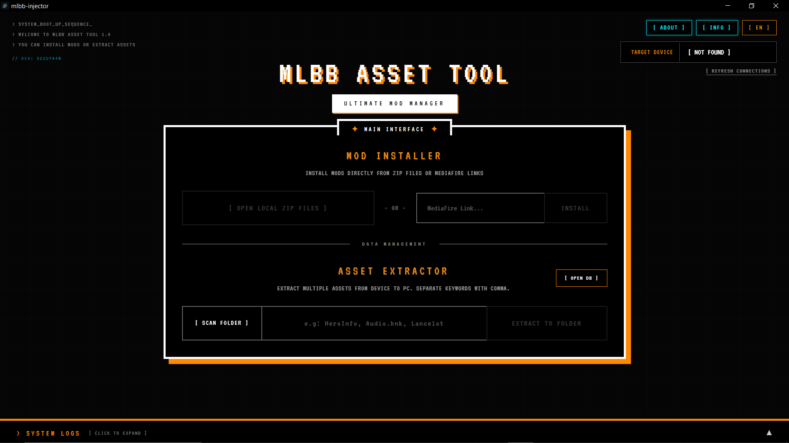

# MLBB Asset Tool & Mod Injector

<div align="center">
  
</div>

A high-performance, cyberpunk-themed desktop application built with **Tauri 2 (Rust + SolidJS)** to seamlessly manage Mobile Legends: Bang Bang assets on Android devices. This tool bypasses the need for manual file managers by interacting directly with the Android filesystem via ADB.

<br>
<div align="center">
  
</div>


## ✨ Features

- ⚡ **Direct Mod Installer:** Inject `.zip` mods or direct MediaFire links straight to your connected Android device without manual extraction or copying.
- 📦 **Asset Extractor:** Pull original or modified assets from the game directory directly to your PC for backup or modification purposes.
- 💾 **Mod Database:** Save, manage, export, and import your favorite extraction keywords/presets into a secure local database.
- 🌐 **Bilingual Support:** Instantly switch between English (`[ EN ]`) and Indonesian (`[ ID ]`) languages.
- 🎨 **Cyberpunk Aesthetic:** Smooth hardware-accelerated CSS animations, Fira Code typography, and a glowing neon hacker interface.

## 🚀 Prerequisites

- Developer Mode and **USB Debugging** must be enabled on your Android device.
- **Node.js** (v18+) and **Rust** installed on your PC (for development only).

## 🛠️ Development

Install dependencies:
```bash
npm install
```

Run in development mode:
```bash
npm run tauri dev
```

Build the final executable (Installer):
```bash
npm run tauri build
```

## 📜 License

This project is open-source and available under the [Apache License 2.0](LICENSE).

---
*Created by [Suzuya4w](https://github.com/Suzuya4w)*
